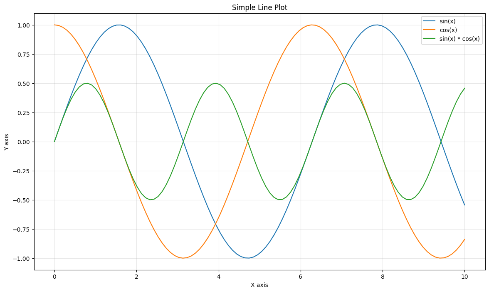
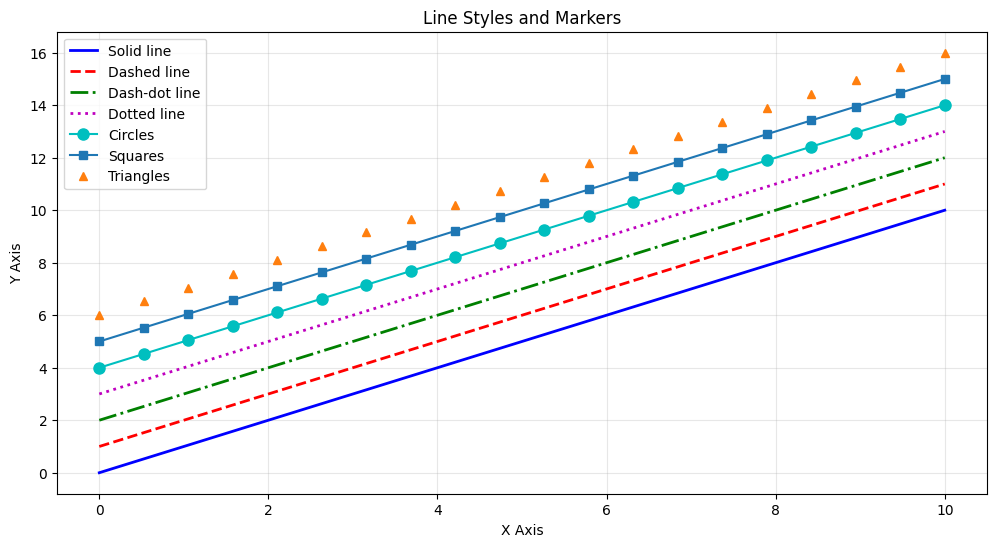
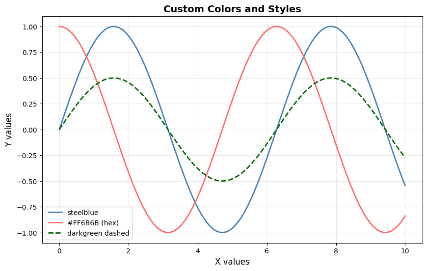
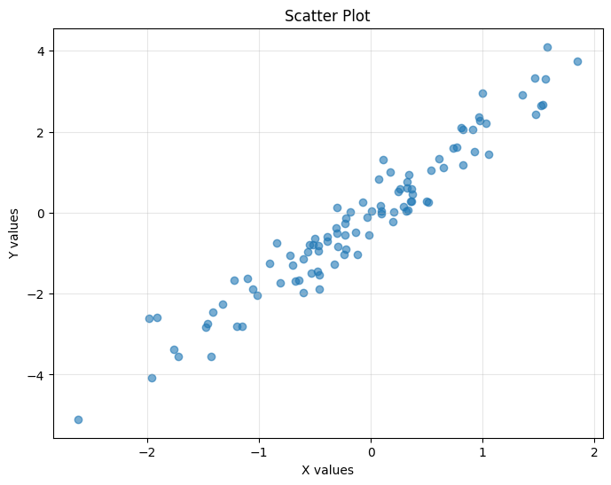
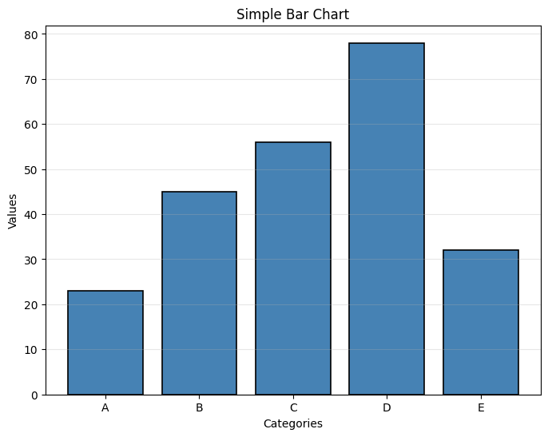
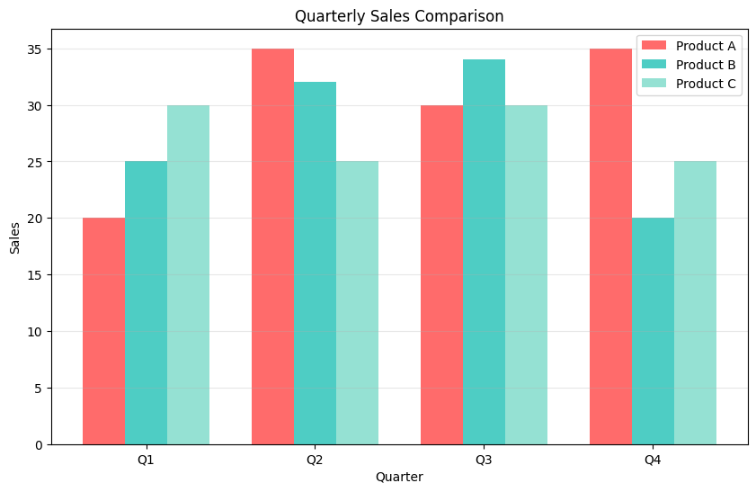
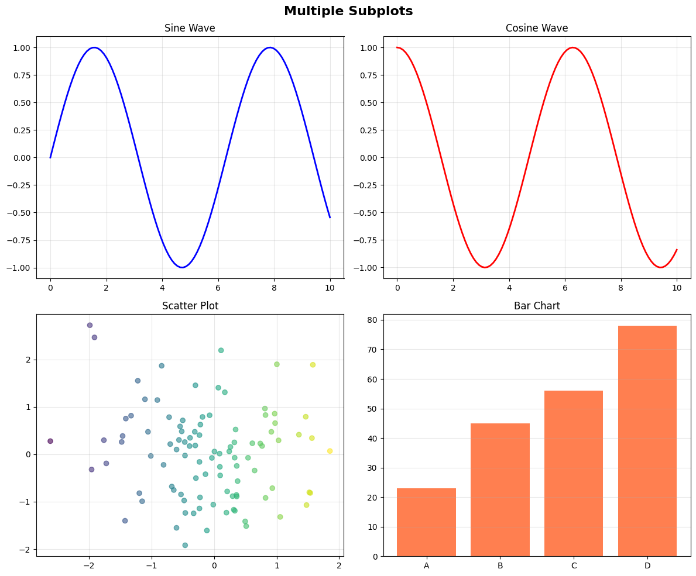
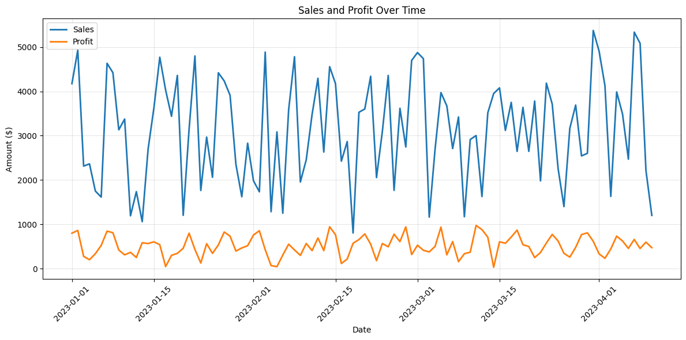

# Usingmatplotlib Module 

## Key Concepts
- Figure: the window or the entire page
- Axes: the actual plotting area
- Axis: the number line projects

## Basic plotting
```python
import pandas as pd
import numpy as np
import matplotlib.pyplot as plt

x = [1,2,3,4,5]
y = [2,4,6,8,10]

plt.plot(x, y)
plt.plot(y, x)
plt.xlabel("X axis")
plt.ylabel("Y axis")
plt.title("Simple Line Plot")
plt.show()
```
```python
x = np.linspace(0, 10, 100) # basically returning an np array of [0, 0.1, 0.2, ..., 10]
y1 = np.sin(x)
y2 = np.cos(x)
y3 = y1 * y2

plt.figure(figsize=(14,8))
plt.plot(x, y1, label="sin(x)")
plt.plot(x, y2, label="cos(x)")
plt.plot(x, y3, label="sin(x) * cos(x)")
plt.xlabel("X axis")
plt.ylabel("Y axis")
plt.title("Simple Line Plot")
plt.legend()
plt.grid(True, alpha=0.3)
plt.show()
```


## Customizing Plots
```python
import numpy as np
import matplotlib.pyplot as plt

x = np.linspace(0, 10, 20)

# Different line styles and markers

plt.figure(figsize=(12, 6))

plt.plot(x, x, 'b-', label='Solid line', linewidth=2)
plt.plot(x, x+1, 'r--', label='Dashed line', linewidth=2)
plt.plot(x, x+2, 'g-.', label='Dash-dot line', linewidth=2)   # note: original had 'g-' but dash-dot is 'g-.'
plt.plot(x, x+3, 'm:', label='Dotted line', linewidth=2)
plt.plot(x, x+4, 'co-', label='Circles', markersize=8)
plt.plot(x, x+5, 's-', label='Squares', markersize=6)
plt.plot(x, x+6, '^', label='Triangles', markersize=6)

plt.xlabel('X Axis')
plt.ylabel('Y Axis')
plt.title('Line Styles and Markers')
plt.legend()
plt.grid(True, alpha=0.3)
plt.show()

# Common format string: '[color][marker][line]'
# Colors: b(blue), r(red), g(green), c(cyan), m(magenta), y(yellow), k(black)
# Markers: o(circle), s(square), ^(triangle), *(star), +(plus), x(x)
# Lines: -(solid), --(dashed), -.(dash-dot), :(dotted)
```

---

```python
import numpy as np
import matplotlib.pyplot as plt

# Using color names and hex codes
x = np.linspace(0, 10, 100)

plt.figure(figsize=(10, 6))
plt.plot(x, np.sin(x), color='steelblue', linewidth=2, label='steelblue')
plt.plot(x, np.cos(x), color='#FF6B6B', linewidth=2, label='#FF6B6B (hex)')
plt.plot(x, np.sin(x)*0.5, color='darkgreen', linestyle='--', linewidth=2, label='darkgreen dashed')

plt.xlabel('X values', fontsize=12)
plt.ylabel('Y values', fontsize=12)
plt.title('Custom Colors and Styles', fontsize=14, fontweight='bold')
plt.legend(fontsize=10)
plt.grid(True, alpha=0.3)
plt.show()
```


---
---

## Scatter Plot
```python
import numpy as np
import matplotlib.pyplot as plt

# Generate sample data
np.random.seed(42)
x = np.random.randn(100)
y = 2 * x + np.random.randn(100) * 0.5  # Linear relationship with noise

# Basic scatter plot
plt.figure(figsize=(8, 6))
plt.scatter(x, y, alpha=0.6)  # alpha controls transparency
plt.xlabel('X values')
plt.ylabel('Y values')
plt.title('Scatter Plot')
plt.grid(True, alpha=0.3)
plt.show()
```


---
---

## Bar Chart 
```python
import matplotlib.pyplot as plt

# Simple bar chart
categories = ['A', 'B', 'C', 'D', 'E']
values = [23, 45, 56, 78, 32]

plt.figure(figsize=(8, 6))
plt.bar(categories, values, color='steelblue', edgecolor='black', linewidth=1.2)
plt.xlabel('Categories')
plt.ylabel('Values')
plt.title('Simple Bar Chart')
plt.grid(True, alpha=0.3, axis='y')  # Only horizontal grid lines
plt.show()
#if you want it to be horizontal just do plt.barh()
```


---

```python
import numpy as np
import matplotlib.pyplot as plt

#Grouped bar chart
categories = ['Q1', 'Q2', 'Q3', 'Q4']
product_a = [20, 35, 30, 35]
product_b = [25, 32, 34, 20]
product_c = [30, 25, 30, 25]

x = np.arange(len(categories))
width = 0.25  # Width of bars

plt.figure(figsize=(10, 6))
# plt.bar(x, height, width, ...) parameters:
# x - width: x-position (shift left by one bar width to position first group)
# product_a: height values for Product A bars
# width: width of each bar (0.25)
# label: text for legend
# color: bar fill color (hex code)
plt.bar(x - width, product_a, width, label='Product A', color='#FF6B6B')
# x: center position for second group (no shift)
plt.bar(x, product_b, width, label='Product B', color='#4ECDC4')
# x + width: x-position (shift right by one bar width to position third group)
plt.bar(x + width, product_c, width, label='Product C', color='#95E1D3')

plt.xlabel('Quarter')
plt.ylabel('Sales')
plt.title('Quarterly Sales Comparison')
plt.xticks(x, categories)
plt.legend()
plt.grid(True, alpha=0.3, axis='y')
plt.show()
```


---
---

## Histogram
```python
import numpy as np
import matplotlib.pyplot as plt

# Generate sample data
np.random.seed(42)
data = np.random.normal(100, 15, 1000)  # Mean=100, Std=15, 1000 points

# Basic histogram
plt.figure(figsize=(10, 6))
plt.hist(data, bins=30, color='skyblue', edgecolor='black', alpha=0.7)
plt.xlabel('Value')
plt.ylabel('Frequency')
plt.title('Histogram of Normal Distribution')
plt.grid(True, alpha=0.3, axis='y')
plt.show()
```

## Subplots
```python
import numpy as np
import matplotlib.pyplot as plt

# Create 2x2 subplot grid
x = np.linspace(0, 10, 100)

fig, axes = plt.subplots(2, 2, figsize=(12, 10))
fig.suptitle('Multiple Subplots', fontsize=16, fontweight='bold')

# Top left: Line plot
axes[0, 0].plot(x, np.sin(x), 'b-', linewidth=2)
axes[0, 0].set_title('Sine Wave')
axes[0, 0].grid(True, alpha=0.3)

# Top right: Cosine
axes[0, 1].plot(x, np.cos(x), 'r-', linewidth=2)
axes[0, 1].set_title('Cosine Wave')
axes[0, 1].grid(True, alpha=0.3)

# Bottom left: Scatter
np.random.seed(42)
x_scatter = np.random.randn(100)
y_scatter = np.random.randn(100)
axes[1, 0].scatter(x_scatter, y_scatter, alpha=0.6, c=x_scatter, cmap='viridis')
axes[1, 0].set_title('Scatter Plot')
axes[1, 0].grid(True, alpha=0.3)

# Bottom right: Bar chart
categories = ['A', 'B', 'C', 'D']
values = [23, 45, 56, 78]
axes[1, 1].bar(categories, values, color='coral')
axes[1, 1].set_title('Bar Chart')
axes[1, 1].grid(True, alpha=0.3, axis='y')

plt.tight_layout()
plt.show()
```


## Using pandas as dataset
```python
import numpy as np
import pandas as pd

np.random.seed(42)
dates = pd.date_range('2023-01-01', periods=100, freq='D')
df = pd.DataFrame({
    'Date': dates,
    'Sales': np.random.randint(1000, 5000, 100) + np.sin(np.arange(100)) * 500,
    'Profit': np.random.randint(200, 800, 100) + np.cos(np.arange(100)) * 200,
    'Region': np.random.choice(['North', 'South', 'East', 'West'], 100)
})

print("Sample DataFrame:")
print(df.head())
print(f"\nDataFrame shape: {df.shape}")
```
Sample DataFrame:
        Date        Sales      Profit Region
0 2023-01-01  4174.000000  801.000000  South
1 2023-01-02  4927.735492  863.060461   East
2 2023-01-03  2314.648713  277.770633  South
3 2023-01-04  2364.560004  203.001501   East
4 2023-01-05  1751.598752  338.271276  North

DataFrame shape: (100, 4)
```python
import matplotlib.pyplot as plt

plt.figure(figsize=(12, 6))
plt.plot(df['Date'], df['Sales'], label='Sales', linewidth=2)
plt.plot(df['Date'], df['Profit'], label='Profit', linewidth=2)
plt.xlabel('Date')
plt.ylabel('Amount ($)')
plt.title('Sales and Profit Over Time')
plt.legend()
plt.grid(True, alpha=0.3)
plt.xticks(rotation=45)
plt.tight_layout()
plt.show()
```
