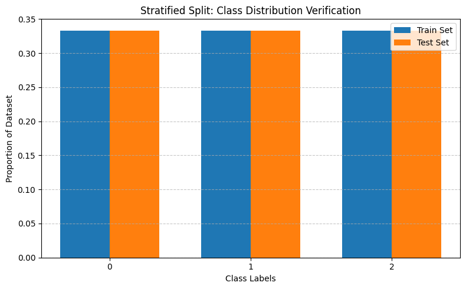
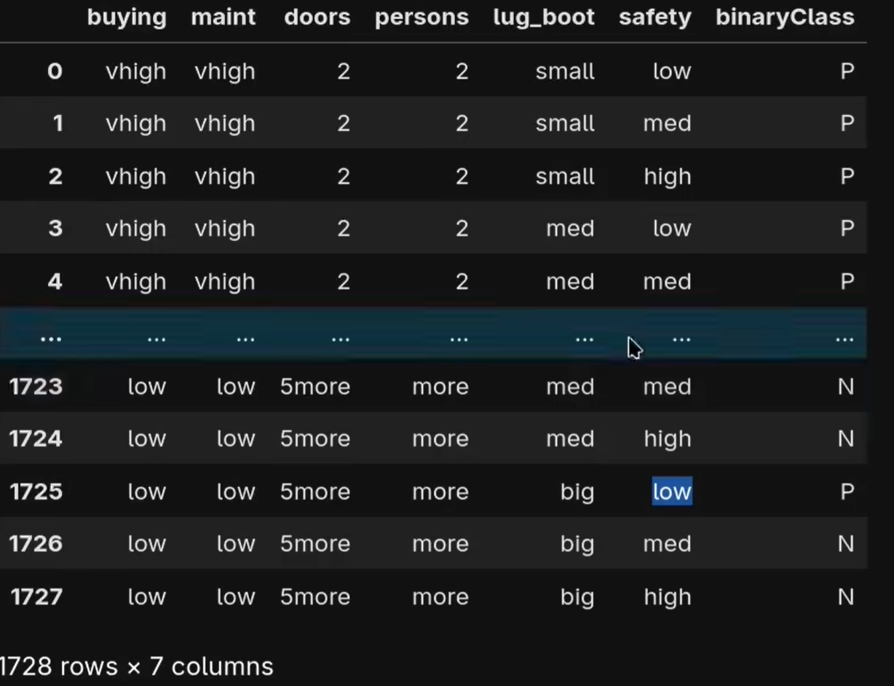
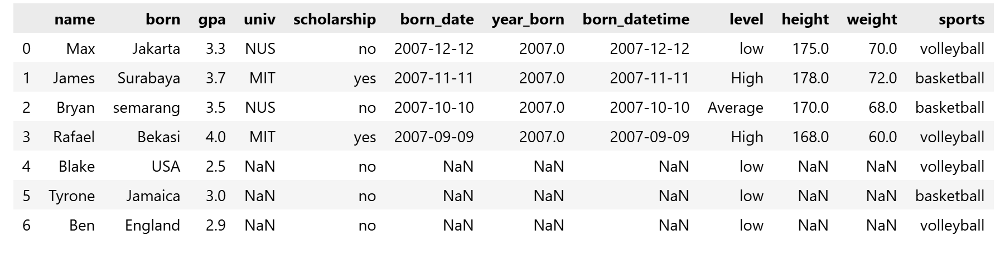

# Using scikit-learn Module

## `sklearn.datasets`
A place that stores many datasets 
```python
import sklearn.datasets
data = sklearn.datasets.load_breast_cancer()
data # returns a dictionary with np.array values
X, y = sklearn.datasets.load_breast_cancer(return_X_y=True) # returns an array (X=features, y=targets)
```

### into pandas dataframe
```python
import pandas as pd
df = sklearn.datasets.load_breast_cancer(as_frame=True).frame
df # the only way probably
```

### to make random data, not really important
```python
from sklearn.datasets import make_blobs, make_moons
import matplotlib as mpl
a, b = sklearn.datasets.make_moons(n_samples=1000, noise=0.1)
mpl.pyplot.scatter(a[:,0], a[:,1], c=b)
```

## `sklearn.model_selection`, splitting data
usually used to split data randomly into testing and training but its imbalanced
### random split (`.train_test_split()`)
```python
import sklearn
X, y = sklearn.datasets.load_iris(return_X_y=True)
X_train, X_test, y_train, y_test = sklearn.model_selection.train_test_split(X, y, test_size=0.2) # random split
```
However, this can be a problem due to imbalance of data split

### balance split (`.StratifiedShuffleSplit()`)
usually for a balance random split
```python
from  sklearn.model_selection import StratifiedShuffleSplit
import numpy as np

split = StratifiedShuffleSplit(n_splits=1, test_size=0.2)
for train_idx, test_idx in split.split(X, y):
    X_train, X_test = X[train_idx], X[test_idx]
    y_train, y_test = y[train_idx], y[test_idx]

# another same simpler method
X_train, X_test, y_train, y_test = train_test_split(X, y, test_size=0.2, stratify=y, random_state=42) 

train_labels, train_counts = np.unique(y_train, return_counts=True)
test_labels, test_counts = np.unique(y_test, return_counts=True)

train_props = train_counts / len(y_train)
test_props = test_counts / len(y_test)

# 2. Set up bar positions
x = np.arange(len(train_labels))
width = 0.35  # Width of each bar

# 3. Create the bar plot
fig, ax = plt.subplots(figsize=(8, 5))
ax.bar(x - width/2, train_props, width, label='Train Set', color='#1f77b4')
ax.bar(x + width/2, test_props, width, label='Test Set', color='#ff7f0e')

# 4. Add labels, title, and styling
ax.set_xlabel('Class Labels')
ax.set_ylabel('Proportion of Dataset')
ax.set_title('Stratified Split: Class Distribution Verification')
ax.set_xticks(x)
ax.set_xticklabels(train_labels)
ax.legend()
ax.grid(axis='y', linestyle='--', alpha=0.7)

# Show the plot
plt.tight_layout()
plt.show()
```


---
---

## Preprocessing (`sklearn.preprocessing`)
### `.fit_transform()`
```python
from sklearn.preprocessing import StandardScaler
X_train, X_test, y_train, y_test = sklearn.model_selection.train_test_split(X, y, test_size=0.2, random_state=42)

scaler = StandardScaler() 
X_train_scaled = scaler.fit_transform(X_train) #basically its functions is making each value standard normal Z = (X - np.mean)/np.std
X_test_scaled = scaler.transform(X_test) 
```
- fit(): Calculates the required statistical parameters from the dataset. For example, a StandardScaler calculates the mean and standard deviation of every feature in your training set.

- transform(): Uses those calculated parameters to scale the actual values.

**If you use .fit_transform() on your test set, you commit a critical mistake called Data Leakage.**
- The Rule: Your model must never see, look at, or adapt to the testing data during training.
- The Consequence: If you re-fit the scaler on the test data, the test data's mean and variance will influence the scaling. This leaks future information into your pipeline, leading to overly optimistic test scores that fail in production.
- The Solution: Always fit the scaler to the training set only, and pass those exact same scaling parameters forward to the test set using .transform().


### `.MinMaxScaler`
```python
from sklearn.preprocessing import MinMaxScaler
X_train, X_test, y_train, y_test = sklearn.model_selection.train_test_split(X, y, test_size=0.2, random_state=42)

scaler = MinMaxScaler()
X_train_scaled = scaler.fit_transform(X_train) #basically its functions is making each value standard normal Z = (X - min(X))/(max(X) - min(X))
X_test_scaled = scaler.transform(X_test) 
```


## Feature Encoding
### `OriginalEncoder`
usually for simple progression or y/n
```python
from sklearn.datasets import fetch_openml
from sklearn.preprocessing import OrdinalEncoder
data = fetch_openml('car', as_frame=True).frame
data
```

In machine learning, only numbers can be computed, no text, therefore some features are required to be encoded.
```python
columns_to_encode = ['lug_boot', 'safety']

encoder = OriginalEncoder(categories=[
    ['small', 'med', 'big'],
    ['low', 'med', 'high'],
])

data[columns_to_encode] = encoder.fit_transform(data[columns_to_encode])
# the columns to be encoded is going to be replaced with [0, 1, 2]
```
if you want to inverse it back into the original state, you can just do `encoder.inverse_transform(data[columns_to_encode])`

### `OneHotEncoder`
for categorical encoder such as countries and professions

```python
from sklearn.preprocessing import OneHotEncoder
encoder = OneHotEncoder(handle_unknown='ignore', sparse_output=False)

encoder_values = encoder.fit_transform(student[['born', 'sports']])
new_cols = encoder.get_feature_names_out(['born', 'sports'])

student_encoded = pd.DataFrame(encoder_values, columns=new_cols, index=student.index)
student = pd.concat([student, student_encoded], axis=1)
student.drop(columns=['born', 'sports'])
```

## Classification
```python
from sklearn.neighbors import KNeighborsClassifier
from sklearn.linear_model import LinearRegression
from sklearn.tree import DecisionTreeClassifier
from sklearn.svm import SVC
from sklearn.naive_bayes import GaussianNB
from sklearn.ensemble import RandomForestClassifier #Usually the strongest classifier
# there are a lot of classifiers other than these too

clf = KNeighborsClassifier()
clf.fit(X_train_scaled, y_train)

clf.score(X_test_scaled, y_test) # returns a score out of 0-1 based on the test
single = X_test_scaled[0] # gets all features of index 0
clf.predict([single]) # predicting the result or outcome based on the features
```

