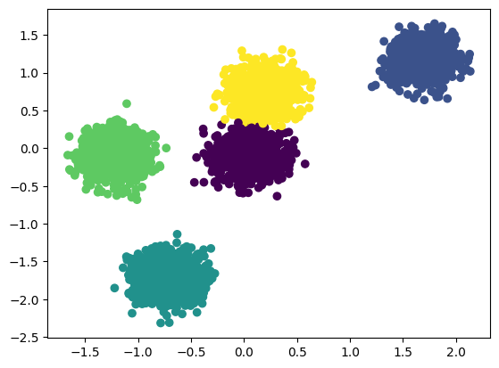

# Using scikit-learn Module

## `sklearn.datasets`
A place that stores many datasets 
```python
import sklearn.datasets
data = sklearn.datasets.load_breast_cancer()
data # returns a dictionary with np.array values
X, y = sklearn.datasets.load_breast_cancer(return_X_y=True) # returns an array (X=features, y=targets)
```

### into pandas dataframe
```python
import pandas as pd
df = sklearn.datasets.load_breast_cancer(as_frame=True).frame
df # the only way probably
```

### to make random data, not really important
```python
from sklearn.datasets import make_blobs, make_moons
import matplotlib as mpl
a, b = sklearn.datasets.make_moons(n_samples=1000, noise=0.1)
mpl.pyplot.scatter(a[:,0], a[:,1], c=b)
```

## `sklearn.model_selection`, splitting data
usually used to split data randomly into testing and training but its imbalanced
### random split (`.train_test_split()`)
```python
import sklearn
X, y = sklearn.datasets.load_iris(return_X_y=True)
X_train, X_test, y_train, y_test = sklearn.model_selection.train_test_split(X, y, test_size=0.2) # random split
```
However, this can be a problem due to imbalance of data split

### balance split (`.StratifiedShuffleSplit()`)
usually for a balance random split
```python
from  sklearn.model_selection import StratifiedShuffleSplit
import numpy as np

split = StratifiedShuffleSplit(n_splits=1, test_size=0.2)
for train_idx, test_idx in split.split(X, y):
    X_train, X_test = X[train_idx], X[test_idx]
    y_train, y_test = y[train_idx], y[test_idx]

# another same simpler method
X_train, X_test, y_train, y_test = train_test_split(X, y, test_size=0.2, stratify=y, random_state=42) 

train_labels, train_counts = np.unique(y_train, return_counts=True)
test_labels, test_counts = np.unique(y_test, return_counts=True)

train_props = train_counts / len(y_train)
test_props = test_counts / len(y_test)

# 2. Set up bar positions
x = np.arange(len(train_labels))
width = 0.35  # Width of each bar

# 3. Create the bar plot
fig, ax = plt.subplots(figsize=(8, 5))
ax.bar(x - width/2, train_props, width, label='Train Set', color='#1f77b4')
ax.bar(x + width/2, test_props, width, label='Test Set', color='#ff7f0e')

# 4. Add labels, title, and styling
ax.set_xlabel('Class Labels')
ax.set_ylabel('Proportion of Dataset')
ax.set_title('Stratified Split: Class Distribution Verification')
ax.set_xticks(x)
ax.set_xticklabels(train_labels)
ax.legend()
ax.grid(axis='y', linestyle='--', alpha=0.7)

# Show the plot
plt.tight_layout()
plt.show()
```


### Walk-forward CV (`.TimeSeriesSplit()`)
the pattern looks like this:
- Round 1: Train on [Oldest] → Test on [1st New One]
- Round 2: Train on [Oldest + 1st New One] → Test on [2nd New One]
- Round 3: Train on [Oldest + 1st New One + 2nd New One] → Test on [3rd New One]
---
---

## Preprocessing (`sklearn.preprocessing`)
### `.fit_transform()`
```python
from sklearn.preprocessing import StandardScaler
X_train, X_test, y_train, y_test = sklearn.model_selection.train_test_split(X, y, test_size=0.2, random_state=42)

scaler = StandardScaler() 
X_train_scaled = scaler.fit_transform(X_train) #basically its functions is making each value standard normal Z = (X - np.mean)/np.std
X_test_scaled = scaler.transform(X_test) 
```
- fit(): Calculates the required statistical parameters from the dataset. For example, a StandardScaler calculates the mean and standard deviation of every feature in your training set.

- transform(): Uses those calculated parameters to scale the actual values.

**If you use .fit_transform() on your test set, you commit a critical mistake called Data Leakage.**
- The Rule: Your model must never see, look at, or adapt to the testing data during training.
- The Consequence: If you re-fit the scaler on the test data, the test data's mean and variance will influence the scaling. This leaks future information into your pipeline, leading to overly optimistic test scores that fail in production.
- The Solution: Always fit the scaler to the training set only, and pass those exact same scaling parameters forward to the test set using .transform().


### `.MinMaxScaler`
```python
from sklearn.preprocessing import MinMaxScaler
X_train, X_test, y_train, y_test = sklearn.model_selection.train_test_split(X, y, test_size=0.2, random_state=42)

scaler = MinMaxScaler()
X_train_scaled = scaler.fit_transform(X_train) #basically its functions is making each value standard normal Z = (X - min(X))/(max(X) - min(X))
X_test_scaled = scaler.transform(X_test) 
```


## Feature Encoding
### `OriginalEncoder`
usually for simple progression or y/n
```python
from sklearn.datasets import fetch_openml
from sklearn.preprocessing import OrdinalEncoder
data = fetch_openml('car', as_frame=True).frame
data
```

In machine learning, only numbers can be computed, no text, therefore some features are required to be encoded.
```python
columns_to_encode = ['lug_boot', 'safety']

encoder = OriginalEncoder(categories=[
    ['small', 'med', 'big'],
    ['low', 'med', 'high'],
])

data[columns_to_encode] = encoder.fit_transform(data[columns_to_encode])
# the columns to be encoded is going to be replaced with [0, 1, 2]
```
if you want to inverse it back into the original state, you can just do `encoder.inverse_transform(data[columns_to_encode])`

### `OneHotEncoder`
for categorical encoder such as countries and professions

```python
from sklearn.preprocessing import OneHotEncoder
encoder = OneHotEncoder(handle_unknown='ignore', sparse_output=False)

encoder_values = encoder.fit_transform(student[['born', 'sports']])
new_cols = encoder.get_feature_names_out(['born', 'sports'])

student_encoded = pd.DataFrame(encoder_values, columns=new_cols, index=student.index)
student = pd.concat([student, student_encoded], axis=1)
student.drop(columns=['born', 'sports'])
```

## Classification
```python
from sklearn.neighbors import KNeighborsClassifier
from sklearn.tree import DecisionTreeClassifier
from sklearn.svm import SVC
from sklearn.naive_bayes import GaussianNB
from sklearn.ensemble import RandomForestClassifier #Usually the strongest classifier
# there are a lot of classifiers other than these too

clf = KNeighborsClassifier()
clf.fit(X_train_scaled, y_train)

clf.score(X_test_scaled, y_test) # returns a score out of 0-1 based on the test
single = X_test_scaled[0] # gets all features of index 0
clf.predict([single]) # predicting the result or outcome based on the features
```

## Regression
the difference between classification and regression is that,
- classification: predicting a class like predicting whether its a cat or a dog or a horse and etc (discrete variable)
- regression: predicting the price of a house (continous variable), but overall same steps with different goals
```python
from sklearn.linear_model import LinearRegression, Lasso, Ridge,ElasticNet
from sklearn.neighbors import KNeighborsRegressor
from sklearn.svm import SVR
from sklearn.ensemble import RandomForestRegressor
from sklearn.tree import DecisionTreeRegressor

reg = LinearRegression()
reg.fit(X_train_scaled, y_train)
reg.score(X_test_scaled, y_test)

single = X_test_scaled[0]
reg.predict([single]) # output = array([2.03865929])
y_test[0] # actual value = np.float64(1.659)
```

## Clustering
Grouping Data
```python
from sklearn.datasets import make_blobs
from sklearn.preprocessing import StandardScaler
import matplotlib.pyplot as plt
from sklearn.cluster import KMeans # usually for make_blobs()
from sklearn.cluster import DBSCAN # usually for make_moons()

X, _ = make_blobs(n_samples=5000, centers=5, random_state=11)

scaler = StandardScaler()
X_scaled = scaler.fit_transform(X)

plt.scatter(X_scaled[:,0], X_scaled[:,1])

kmeans = KMeans(n_clusters=5)
kmeans.fit(X_scaled)
plt.scatter(X_scaled[:,0], X_scaled[:,1], c=kmeans.labels_)
```


## Model Comparison (Regressor)
| Model | What It Does (In Plain English) | Good For | Watch Out For |
|-------|--------------------------------|----------|----------------|
| LinearRegression | Draws a straight line through your data. Assumes every feature has a constant, linear effect on the target. | Quick baseline. If your data is simple, it’s fast and interpretable. | Can’t capture interactions (e.g., “high RSI plus high implied move is super bullish” – it would miss that). |
| Lasso / Ridge / ElasticNet | Like LinearRegression, but with a penalty for having too many features. They automatically ignore useless features (Lasso sets coefficients to zero). | When you have many features and you suspect some are noise. Great for feature selection. | Lasso can drop features you might want to keep. ElasticNet blends Lasso and Ridge for a middle ground. |
| DecisionTreeRegressor | Asks a series of yes/no questions (e.g., “Is implied move > 7%? If yes, then is RSI < 60?”) and arrives at a predicted number. | Easy to visualise and explain. Captures interactions naturally. | Tends to overfit – it can memorise the training data instead of learning patterns. |
| RandomForestRegressor | Builds many decision trees on random subsets of data and averages their predictions. This “crowd wisdom” reduces overfitting. | Your strongest out‑of‑the‑box model. Works well with mixed data types and handles missing data gracefully. | A bit slower than a single tree, but still fast. Harder to interpret than a single tree. |
| SVR (Support Vector Regression) | Tries to fit a “tube” around the data and ignores small errors inside the tube. Only cares about the big misses. | Can model complex, non‑linear relationships. Works well with scaled data. | Sensitive to hyperparameters. Slower on large datasets. |
| KNeighborsRegressor (not in your list, but worth knowing) | Predicts the target by averaging the values of the k most similar training samples. | Very intuitive. No training phase. | Slower at prediction time. Doesn’t work well with many features. |

## Classifier Comparison
- KNeighborsClassifier: “I predict what my neighbours are.”
- DecisionTreeClassifier: “If this, then that, else that.”
- RandomForestClassifier: “A committee of trees votes.”
- SVC: “I draw a boundary between classes with the widest possible margin.”
- GaussianNB: “I assume features are independent and follow a bell curve.”


## PCA 
simple feature decomposition, information loss for faster run while also maintaining quality, the model accuracy: 96.67% (64 features) -> 91.2% (10 features)

```python
from sklearn.decomposition import PCA
from sklearn.datasets import load_digits
from sklearn.model_selection import train_test_split
from sklearn.preprocessing import StandardScaler
from sklearn.ensemble import RandomForestClassifier

X, y = load_digits(return_X_y=True)
pca = PCA(n_components=10) # how many features do you want after reduced
X.shape # (1797, 64)

X_train, X_test, y_train, y_test = train_test_split(X, y, random_state=13, test_size=0.2)

scaler = StandardScaler()
X_train_scaled = scaler.fit_transform(X_train)
X_test_scaled = scaler.transform(X_test) 

X_train_reduced = pca.fit_transform(X_train_scaled) # 64 -> 10
X_test_reduced = pca.transform(X_test_scaled)

clf = RandomForestClassifier()
clf.fit(X_train_reduced, y_train)
```

## Metrics
to evaluate your model
```python
# for classifier
from sklearn.metrics import accuracy_score, precision_score, recall_score, f1_score

# for regressor
from sklearn.metrics import r2_score, mean_absolute_error, mean_squared_error, root_mean_squared_error

y_pred = clf.predict(X_test_reduced)
accuracy_score(y_test, y_pred)
```

## Model Evaluation Metrics: Classification vs. Regression

The core difference is that **classifier metrics evaluate discrete category predictions**, while **regressor metrics evaluate continuous numerical predictions**.

---

### 1. Classification Metrics
These metrics measure how well a model assigns data points to the correct classes or categories. They rely on the counts of True Positives ($TP$), True Negatives ($TN$), False Positives ($FP$), and False Negatives ($FN$).

#### Accuracy Score
Measures the proportion of total correct predictions out of all predictions made.
$$\text{Accuracy} = \frac{TP + TN}{TP + TN + FP + FN}$$
* **Best used when**: The classes in the dataset are well-balanced.

#### Precision Score
Measures the proportion of correctly predicted positive instances out of all instances predicted as positive.
$$\text{Precision} = \frac{TP}{TP + FP}$$
* **Best used when**: The cost of a False Positive is high (e.g., email spam detection).

#### Recall Score
Measures the proportion of correctly predicted positive instances out of all actual positive instances.
$$\text{Recall} = \frac{TP}{TP + FN}$$
* **Best used when**: The cost of a False Negative is high (e.g., medical diagnosis).

#### F1 Score
Represents the harmonic mean of precision and recall to provide a balanced single score.
$$\text{F1} = 2 \times \frac{\text{Precision} \times \text{Recall}}{\text{Precision} + \text{Recall}}$$
* **Best used when**: The dataset has imbalanced classes.

---

### 2. Regression Metrics
These metrics measure the distance or error between the predicted numerical values ($\hat{y}$) and the actual target numerical values ($y$).

#### R2 Score ($R^2$)
Measures the proportion of variance in the dependent variable that is predictable from the independent variables (Coefficient of Determination).
$$R^2 = 1 - \frac{\sum (y_i - \hat{y}_i)^2}{\sum (y_i - \bar{y})^2}$$
* **Best used when**: You want a standardized percentage score (usually 0 to 1) indicating overall model fit.

#### Mean Absolute Error (MAE)
Measures the average absolute distance between predicted and actual values.
$$\text{MAE} = \frac{1}{n} \sum_{i=1}^{n} |y_i - \hat{y}_i|$$
* **Best used when**: You want errors penalized linearly, making it highly interpretable in original target units.

#### Mean Squared Error (MSE)
Measures the average of the squared differences between predicted and actual values.
$$\text{MSE} = \frac{1}{n} \sum_{i=1}^{n} (y_i - \hat{y}_i)^2$$
* **Best used when**: You want to heavily penalize large outlier errors.

#### Root Mean Squared Error (RMSE)
Represents the square root of the MSE, bringing the error metric back to the scale of the original target units.
$$\text{RMSE} = \sqrt{\frac{1}{n} \sum_{i=1}^{n} (y_i - \hat{y}_i)^2}$$
* **Best used when**: You want target-unit interpretability while still penalizing large outlier errors.

---

### ✅ Summary of Differences
* **Classification metrics** evaluate discrete labels (e.g., Yes/No, Spam/Ham) based on right vs. wrong counts.
* **Regression metrics** evaluate numerical trends (e.g., Stock prices, Temperature) based on the physical distance between the true value and the prediction.


## Cross-validation
```python
from sklearn.model_selection import cross_val_score
clf = KNeighborsClassifier()
scores = cross_val_score(clf, X_scaled, y, cv=5)
scores # array([0.96491228, 0.95614035, 0.98245614, 0.95614035, 0.96460177])
```

## Hyperparameter-tuning 
finding the best hyperparemeter
```python
from sklearn.datasets import load_breast_cancer
from sklearn.ensemble import RandomForestClassifier
from sklearn.model_selection import train_test_split


X, y = load_breast_cancer(return_X_y=True)
X_train, X_test, y_train, y_test = train_test_split(X, y, random_state= 15, test_size=0.2)

clf = RandomForestClassifier(n_jobs=-1)

param_grid = {
    'n_estimators': [70, 75, 80, 100],
    'max_depth': [None, 5, 7],
    'min_samples_split': [1, 3, 4, 5]
}

from sklearn.model_selection import GridSearchCV

grid = GridSearchCV(clf, param_grid, cv=3)
grid.fit(X_train, y_train)
grid.best_params_
#output = {'max_depth': 7, 'min_samples_split': 4, 'n_estimators': 80}
grid.best_estimator_ # best estimator
```


## Pipeline
```python
from sklearn.datasets import load_breast_cancer
from sklearn.ensemble import RandomForestClassifier
from sklearn.model_selection import train_test_split
from sklearn.preprocessing import StandardScaler
from sklearn.decomposition import PCA

X, y = load_breast_cancer(return_X_y=True)
X_train, X_test, y_train, y_test = train_test_split(X, y, random_state= 15, test_size=0.2)

from sklearn.pipeline import Pipeline

pipe = Pipeline([
    ('scaling', StandardScaler()),
    ('reduction', PCA(n_components=12)),
    ('model', RandomForestClassifier())
])

pipe.fit(X_train, y_train)

pipe.score(X_test, y_test)
# output = 0.9298245614035088
```