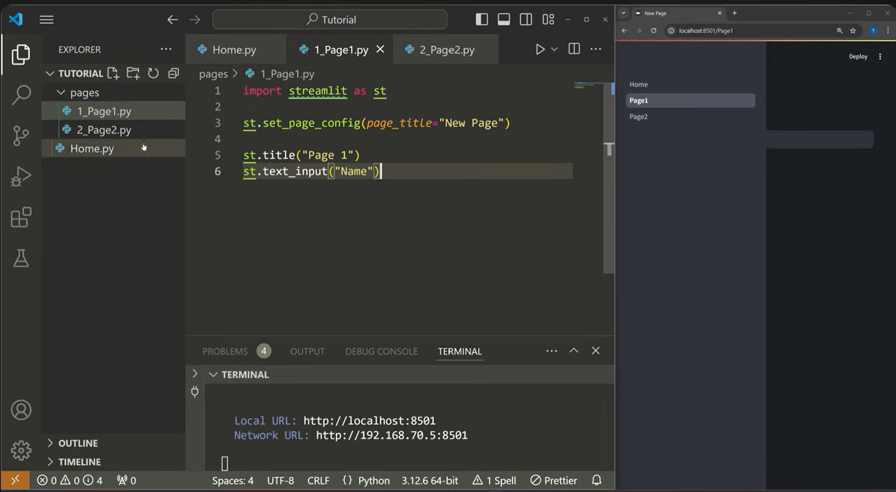

# using the streamlit module
## Simple elements, really similar to html
```python
import streamlit as st
import 
st.markdown("# hi")
st.title("trying streamlit")
st.header("pretty cool")
st.subheader("nicee")
st.text("nihao")
st.markdown(
    ```
    @echo off
    echo sending data to google...
    pause
    cls
    ping -n 1 8.8.8.8 >nul
    if errorlevel 0 exit /b
    echo failure
    pause
    ```
)

st.divider()
st.write("comparing to st")
st.markdown("---")
code = 
"""
@echo off
echo sending data to google...
pause
cls
ping -n 1 8.8.8.8 >nul
if errorlevel 0 exit /b
echo failure
pause
"""
st.code(body=code, language="batch")

py_code = """
import pandas as pd 
import sklearn.datasets import Datasets

data = Datasets("load_iris")
columns = data.column.tolist()
"""
st.code(py_code, language="python")

st.write("hello world")

st.image("md-note\image-7.png", width=100)
st.button("press me", type="primary")
```

## working with dataframes
```python
df = pd.DataFrame({
    'name': ['bob', 'max', 'nick'],
    'gpa': [3.5, 3.4, 3.0],
    'scholarship': ["yes", "yes", "no"] 
})

st.dataframe(df)
st.data_editor(df)
st.table(df)
st.metric(label="gpa_mean", value=df['gpa'].mean())
```

## working with charts
```python
# available simple charts in st:
# - st.line_chart()
# - st.bar_chart()
# - st.area_chart()
# - st.bar_chart()
# - st.map()

import pandas as pd
import numpy as np
import matplotlib.pyplot as plt
df_chat = pd.DataFrame(np.random.randn(20,3), columns=["A", "B", "C"])
st.scatter_chart(df_chat)
st.pyplot() # to use pyplot function
```

## working with forms
```python
import streamlit as st
import pandas as pd
import numpy as np
import matplotlib.pyplot as plt
from datetime import datetime
st.header("Sample Form")
form_values = {
    'name': None,
    'feedback': None,
    'birth': None,
    'time': None,
    'choice': None,
    'gender': None,
    'slider_value': None,
    'theme': None,
    'rerun_value': None
}

date_min = datetime(1950, 1, 1)
dete_max = datetime.today()
with st.form(key="sample-forum"):

    st.subheader("Text Input")
    form_values['name'] = st.text_input("Enter your name: ")
    form_values['feedback'] = st.text_area("Feedback:")

    st.subheader("Date & Time")
    form_values['birth'] = st.date_input("Please enter your birth date:", min_value=date_min, max_value=dete_max)
    form_values['time'] = st.time_input("preferred time input:")

    st.subheader("Selectors")
    form_values['choice'] = st.radio("choose an option:", ["option 1", "option 2", "option 3"])
    form_values['gender'] = st.selectbox("Select your gender:", ['male', 'female', 'others'])
    form_values['slider_value'] = st.select_slider("select a range:", options=[1, 2, 3, 4, 5])

    st.subheader("toogles & checkboxes")
    form_values['theme'] = st.checkbox("enable dark mode", value=False)
    form_values['rerun_value'] = st.toggle("Always rerun", value=False)

    submit_btn = st.form_submit_button()
    if submit_btn:
        if not all(form_values.values()):
            st.warning("please fill the form")
        else:
            st.balloons()
            st.write("### Info")
            for (key, value) in form_values.items():
                st.write(f"{key}: {value}")
```

## working with session state
```python
import streamlit as st

if "counter" not in st.session_state:
    st.session_state.counter = 0

if st.button("Increment button"):
    st.session_state.counter += 1
    st.write(f"incremented to {st.session_state.counter}")

if st.button("reset"):
    st.session_state.counter = 0

st.write(f"Counter value = {st.session_state.counter}")
```

## working with callbacks
when an a button is pressed or an event is occured, the the funtion corresponding to that button is activated before the next rerun
```python
import streamlit as st

if "step" not in st.session_state:
    st.session_state.step = 1

if "info" not in st.session_state:
    st.session_state.info = {}

# callback fn
def go_to_step2(name):
    st.session_state.info["name"] = name
    st.session_state.step = 2

def go_to_step1():
    st.session_state.step = 1
    
if st.session_state.step == 1:
    st.header("Part 1: Info")
    
    name = st.text_input("Name", value=st.session_state.info.get("name", ""))
    
    st.button("Next", on_click=go_to_step2, args=(name,))

if st.session_state.step == 2:
    st.header("Part 2: Review")
    
    st.subheader("Please review this:")
    st.write(f"**Name**: {st.session_state.info.get('name', '')}")
    
    if st.button("Submit"):
        st.balloons()
        st.success("Great!")

    st.button("back", on_click=go_to_step1)

```

## Working with layouts
```python
import subprocess
import sys
import os

app_dir = os.path.dirname(os.path.abspath(__file__))
project_root = os.path.dirname(app_dir)
os.chdir(project_root)

skip_files = {
    "explore_earnings.py"
    "build_targets.py",
    "config.py",
    'daily_update_features.py',
    'evaluation_features.py',
    'features_library.py',
    "init_features_table.py",   # run once manually
    "fetch_multiple_stocks.py", # run separately
    "fetch_price_history.py",   # run separately
    "run_all_features.py",      # don't run itself
    "__init__.py",              # if any
    'historical_earnings_date.py', 
    'historical_feature.py',
    'populate_features_batch.py', 
    'testing.py', 
    'train_model.py',
    'guidance_data.py',
    'guidance_model.py'
}

all_files = [f for f in os.listdir(app_dir) if f.endswith('.py')]

all_files.sort()

for script in all_files:
    # Skip excluded files
    if script in skip_files:
        print(f"Skipping {script}")
        continue

    script_path = os.path.join("app", script) 

    print(f"\n{'='*60}")
    print(f"Running {script_path}...")
    print('='*60)
    try:
        subprocess.run([sys.executable, script_path], check=True)
        print(f"{script} completed successfully.")
    except subprocess.CalledProcessError as e:
        print(f"{script} failed with exit code {e.returncode}. Continuing...")
    except Exception as e:
        print(f"Unexpected error running {script}: {e}")

print("\nAll feature scripts have been processed.")
```

## Advance widget
basically, making sure objects arent duplicate by using different id (html) or the key parameter (streamlit)

## Caching 
very important for performance speed, note that cache is a global variable for everyone that access the streamlit page
### cache_data
```python
import streamlit as st
import time

@st.cache_data(ttl=60)  # Cache this data for 60 seconds
def fetch_data():
    # Simulate a slow data-fetching process
    time.sleep(3)  # Delays to mimic an API call
    return {"data": "This is cached data!"}

st.write("Fetching data...")
data = fetch_data()
st.write(data)
```
### cache_resource
```python
import streamlit as st

file_path = "example.txt"

@st.cache_resource
def get_file_handler():
    # Open the file in append mode, which creates the file if it doesn't exist
    file = open(file_path, "a+")
    return file

# Use the cached file handler
file_handler = get_file_handler()

# Write to the file using the cached handler
if st.button("Write to File"):
    file_handler.write("New line of text\n")
    file_handler.flush()  # Ensure the content is written immediately
    st.success("Wrote a new line to the file!")

# Read and display the file contents
if st.button("Read File"):
    file_handler.seek(0)  # Move to the beginning of the file
    content = file_handler.read()
    st.text(content)

# Always make sure to close the file when done (useful for resource cleanup)
st.button("Close File", on_click=file_handler.close)
```

## Rerun manually 
```python
import streamlit as st

st.title("Counter Example with Immediate Rerun")

if "count" not in st.session_state:
    st.session_state.count = 0

def increment_and_rerun():
    st.session_state.count += 1
    st.rerun()

st.write(f"Current Count: {st.session_state.count}")

if st.button("Increment and Update Immediately"):
    increment_and_rerun()
```

## fragments
usually to rerun certain fragments
```python
import streamlit as st

st.title("My Awesome App")

@st.fragment()
def toggle_and_text():
    cols = st.columns(2)
    cols[0].toggle("Toggle")
    cols[1].text_area("Enter text")

@st.fragment()
def filter_and_file():
    new_cols = st.columns(5)
    new_cols[0].checkbox("Filter")
    new_cols[1].file_uploader("Upload image")
    new_cols[2].selectbox("Choose option", ["Option 1", "Option 2", "Option 3"])
    new_cols[3].slider("Select value", 0, 100, 50)
    new_cols[4].text_input("Enter text")

toggle_and_text()
cols = st.columns(2)
cols[0].selectbox("Select", [1, 2, 3], None)
cols[1].button("Update")
filter_and_file()

```

## multiple pages

depends on your streamlit file structure